# 컴포넌트를 이용하여 페이지를 만들어보자

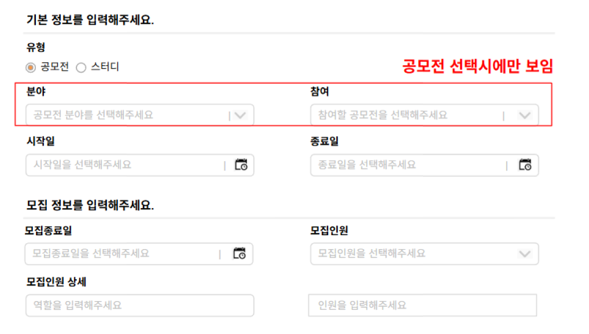

많아 보이지 사실상 select, input 태그들만 만들면 그냥 끝이다

어서 해보자

✅ 참고

- 본 예제에서 사용하는 색들은 죄다 우리가 등록한 variables에서 사용했다

- variables, auto layout 사용법은 이전 글을 보면 알 수 있다

- autoLayout 의 단축키는 `shift + A`

- 그룹화는 `ctrl + G` 다

## input 창을 만들자

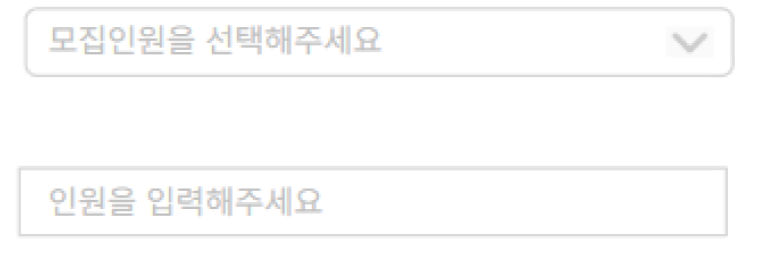

보면 select 창이든 input 창이든 디자인이 똑같다 (radius 있냐 없냐 차이)

그럼 input 창을 디자인하고 아이콘만 얹으면 된다

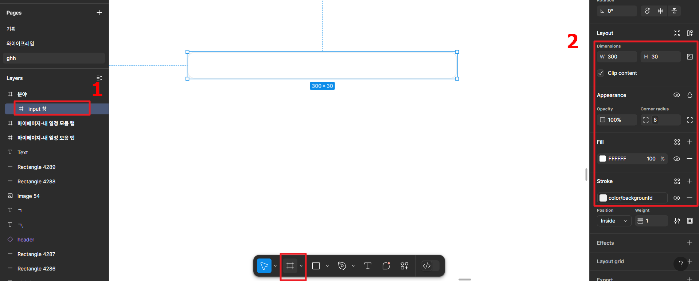

1. 프레임으로 input 창을 만들어줬다. (피그마 하단 네비의 2번째 칸)

2. 사이즈는 (300 \* 30)

   radius 는 var 에 있는 border/radius(8)

   (예시로 준 사진엔 radius가 없는데 난 그냥걍 줬다 맘에 안 들면 직접 와서 바꾸던지 본인이 만들 거로 교체하든지 알아서 해라)

   배경은 FFFFF

   테두리는 var에 있는 color/backgroundfd 를 사용했다

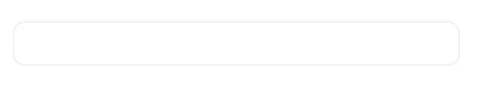

그러면 이렇게 된다.

자 이제 text 를 넣어보자

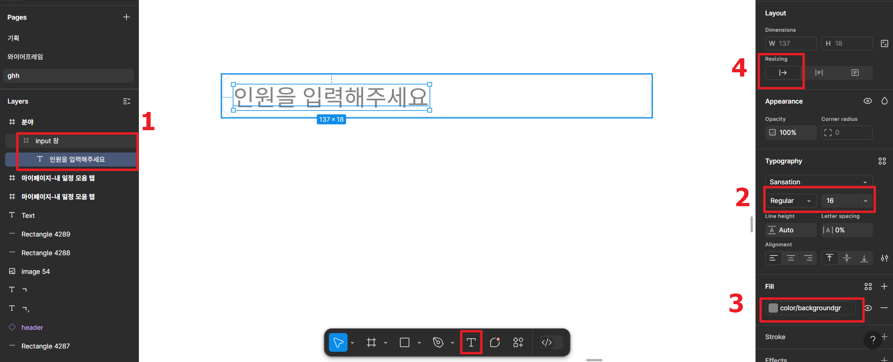

1. input 프레임 안에 text 를 넣고 text 값도 넣어주자

   text 태그 넣는 건 하단 네비 5번째다

2. 폰트 크기는 레귤러, 폰트 크기는 var 에서 middle(16)

3. 폰트 컬러는 color/backgroundgr 로 했다

4. 그리고 text 태그를 리사이징해서 크기를 맞추자

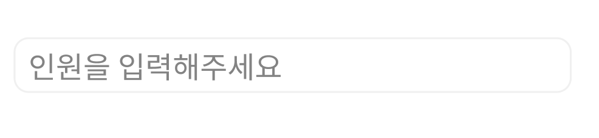

그러면 이렇게 된다.

input 창은 사실 이렇게만 하고 치워도 된다.

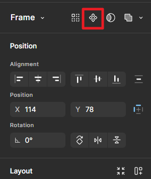

여기서 그냥 오른쪽 네비의 컴포넌트 생성해서 그냥 써도 된다.

하지만 우린 단순히 input 창만 쓸 게 아니라 select로 만들어서 쓸 것이다

우선 input 태그(프레임)을 복붙해서 그걸로 select 창이라고 이름을 바꾸자

그리고 우리가 아까 만든 input 태그를 컴포넌트해서 치우자 (오른쪽 네비 최상단 마름모4개 아이콘)

컴포넌트를 복붙하면 인스턴스로 생성된다.

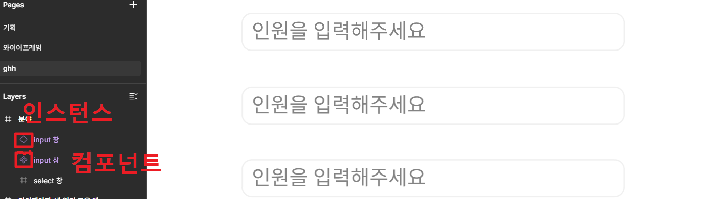

순서대로 빈마름모 인스턴스

컴포넌트

그리고 select 프레임

## Select 창 만들기

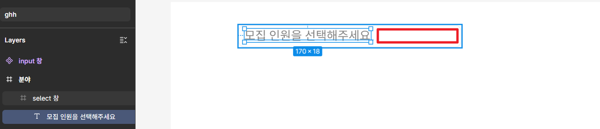

text 값을 바꾸고 옆에 | 와 다운 아이콘을 넣어오려면 구간을 나눌 필요가 있다

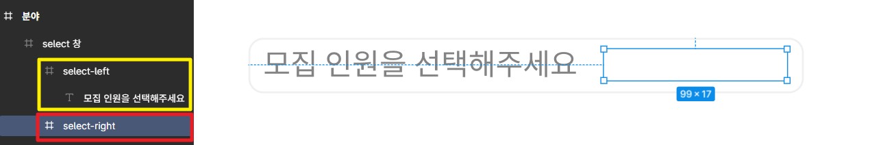

select 프레임 안에 프레임 2개를 새로 생성해서 select-left, select-right 로 이름 짓자

left 안에는 text 를 넣어주었고

이제 right 에 아이콘들을 넣어주자

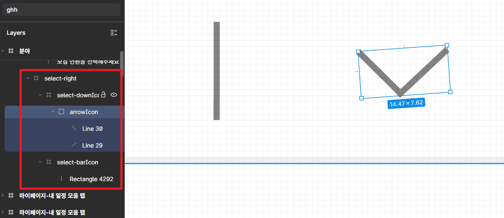

- select-downIcon 이라는 프레임을 만들고 안에 10,11px 라인을 두개 만들어 적당히 붙혀놓고 그걸 그룹화(`ctrl + G`)로 묶었다

- select-barIcon 의 경우 그냥 16px 높이의 라인 하나 세웠다

- 둘다 color 는 backgroundgr

이제 select-right 를 선택해서 오토레이아웃(`shift + A`) 해주자

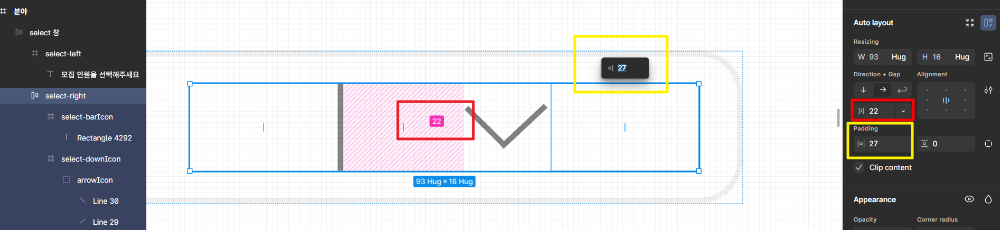

select-right 를 오토레이아웃 하면 정렬이 되는데

빨간색 박스는 gap 이고 노란색 박스는 padding 이다

나는 padding 을 오른쪽만 7로 하고 gap 은 14로 했다

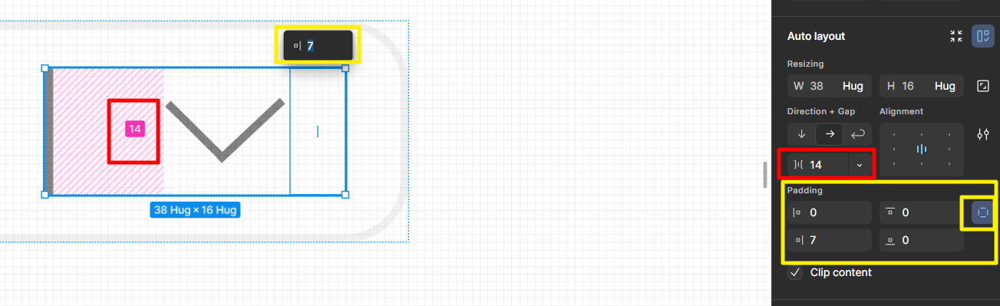

이제 위로 올라가 select 프레임을 오토레이아웃 해주자

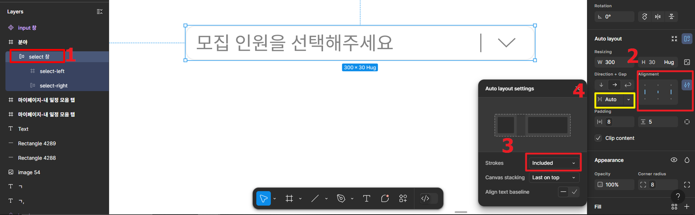

1. select 를 오토레이아웃으로 만들어주고

2. align center로 해준다

3. 왼쪽의 auto layout setting 을 누르면 창이 뜨는데 strokes를 included 로 바꿔주자

   나는 이걸 `box-sizing: border-box;` 라고 생각하고 말했는데

   찾아보니 **프레임 사이즈 안에 선 굵기를 포함** 이라고 한다

4. padding(8,5)과 gap을 auto 로 조정해주자

그리고 마지막으로 select 창을 컴포넌트로 만들어주자

그럼 이렇게 된다

아직 안끝났다

달력도 해야지

vector icon 이미지를 구해왔다(comm 프레임에 그대로 있을테니 복붙해서 해보자)

## 컴포넌트를 이용해 새로운 컴포넌트 만들기

우리 개발할 때 클래스 가져다 오버라이딩해서 바꿔쓰고 하지 않는가

그것처럼 기존 컴포넌트를 바꿔다가 새 컴포넌트를 만들어보자

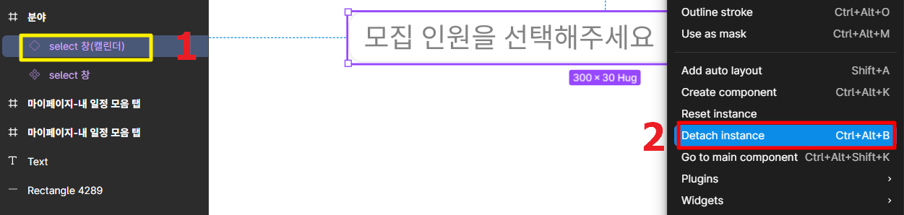

1. select 창 인스턴스를 만들고 이름을 바꾸자 이름은 대충 `select창(캘린더)`로 바꿨다

2. 그리고 오른쪽 마우스를 눌러주면 Detach instance 를 눌러주자

   그럼 인스턴스가 해제되고 일반 오토레이아웃 프레임이 된다

3. 이제 select창(캘런더)를 컴포넌트로 만들어주자

   (오른쪽 상단네비를 이용하거나, 오른쪽 마우스를 눌러 Create component를 누름 됨)

❗ 무조건 Detach instance 를 해주고 create component를 해주자

다 해주면 이렇게 되야한다

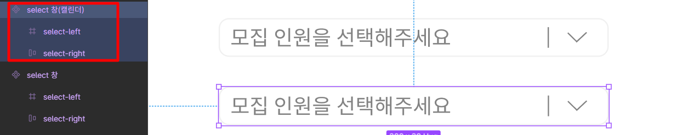

자 이제 달력 아이콘을 사이즈를 적당히 조절해 주고 박아주자

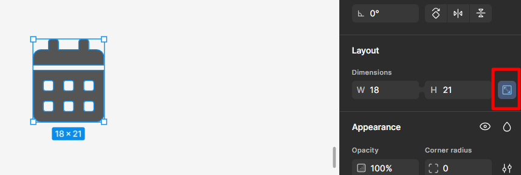

사이즈 조절 옆에 lock aspect ratio 라고 비율에 맞게 사이즈 조절해 주는거 눌러주면 편하게 사이즈 조절이 가능하다

자 이제 넣어보자

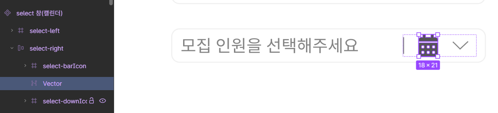

이미 우리가 차근차근 쌓아놨기 때문에 downIcon에 부분에 넣어주고 downIcon을 없애버리면 된다

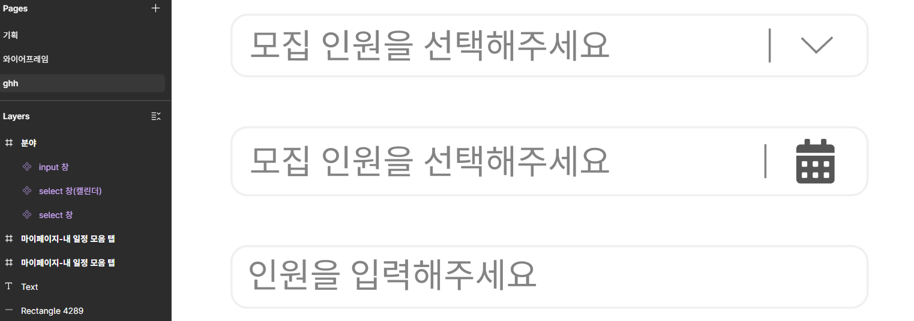

그럼 이렇게 총 3개의 컴포넌트가 완성됐다

이걸 라벨을 붙여서 새로 컴포넌트로 만들어주던지, 오토레이아웃으로 묶어만 두던지 하고

이제 우리 html div 감싸는 거랑 똑같이 쌓으면 끝이다

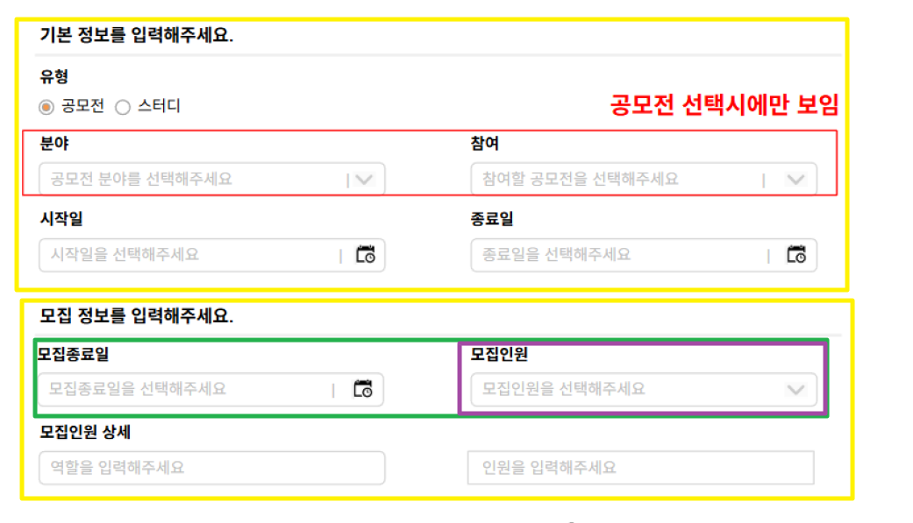

하나하나 다 그리면 괜히 난잡하기에 생략하겠다

계속 그룹화랑 오토레이아웃으로 묶어주면서 정렬해 주면 된다

이 과정도 생략하겠다

다 설명하면 너무 길어진다 이미 아주 길다.

이걸 다 해주면 이렇게 된다

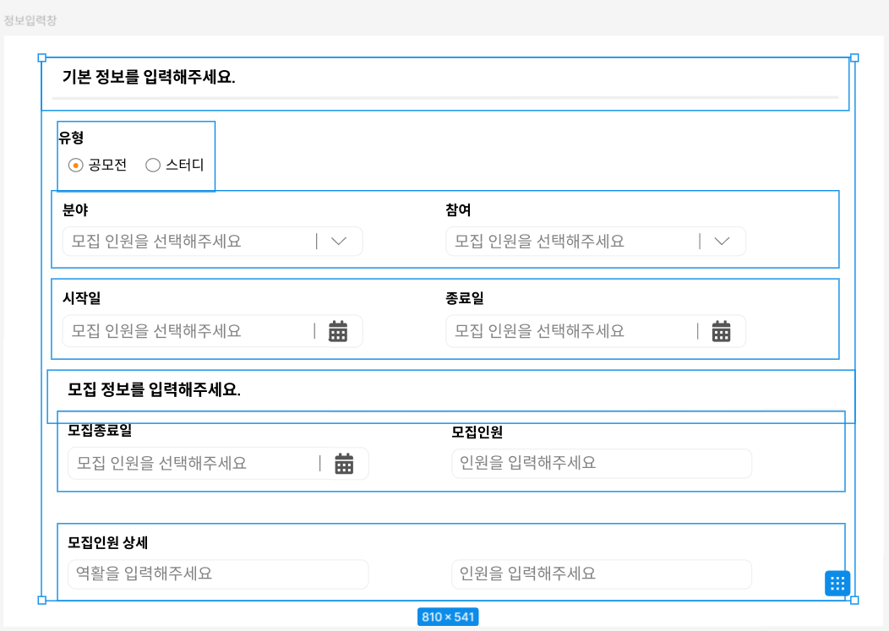

이렇게 하나하나 쌓아둔 걸 모두 선택해 주고 오토레이아웃해주면 된다

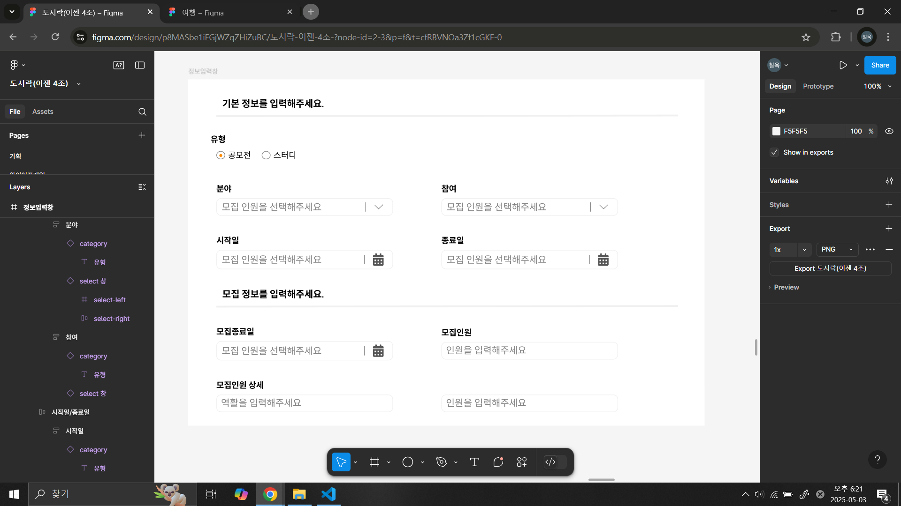

**끝**

## 예상 질문

### 1. justify-content: space-between; 는 어떻게 함?

> align 을 센터로 해놓고 gap 을 auto로 하면 됨

### 2. 오토레이아웃 해주고 리사이징 해주면 내가 설정한 값보다 늘어나거나 줄어드는데?

> 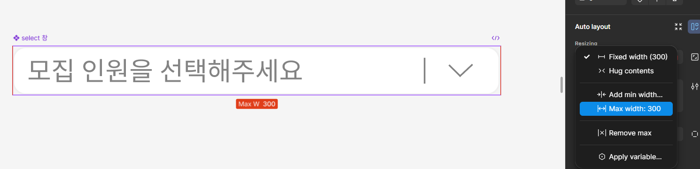
> 최대, 최소 넓이를 넣어주자

### 그냥 인스턴스에서 바로 create component 하면 뭐가 문제임?

> 인스턴스는 수정이 불가능함
> 그리고 인스턴스가 컴포넌트로 바뀌는 게 아니라
> 새 컴포넌트가 만들어지면서 그 안에 인스턴스가 들어가 있는 형태가 되니
> 걍 의미가 없음
