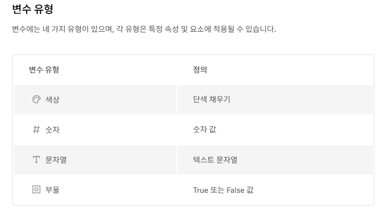
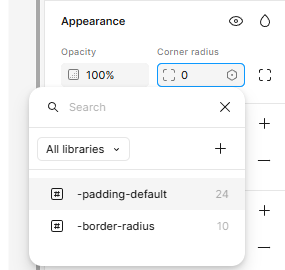

# 피그마 변수와 오토레이아웃 사용법

## 1. 변수 위치 및 사용방법

### 1-1. 위치

붉은 색 위치를 누르면 왼쪽 창이 뜬다

### 1-2. 사용 방법

왼쪽 창을 보면 Create variable 이 있다

그걸로 변수를 만들면 된다

### 1-3. 변수 유형

## 2. 적용 방법

### 2-1. border-radius 값을 줘보자

사각형에 border-radius 를 줘보자

그림처럼 왼쪽에 border-radius 변수를 만들어주고 오른쪽 `Appearance` 란의 `Corner radiud` 를 누르면 저 사진처럼 육각형의 아이콘이 생긴다

해당 육각형을 누르면 위 사진과 같이 변수들이 나오고 해당 변수를 적용해주면 된다

## 3. Auto Layout

이 학습의 핵심

padding, margin 등을 피그마에서 기본적으로 부여해주고

나중에 요소가 추가되어도 해당 padding, margin 등에 맞춰서 알아서 간격을 맞춰주면

정른쪽 네비바에 Auto layout 란이 나타나게 된다.

그리고 붉은 색 박스에 있는 padding 란으로 우리가 설정한 padding-default 변수를 넣어주면 된다!

그러면 이제 앞으로 해당 프레임에 다른 요소가 들어가도 해당 padding 값에 맞춰준다

그밖에도 gap, just-content, align-item 도 할 수 있다

알아서 잘 찾아서 해보자!

## 4. 네이밍

예제에서는 -OOO-??? 이런식으로 네이밍 했지만

`color/black`, `padding/default` 이런식으로 짓는것이 좋다

귀찮아서 이미지를 찍지는 않겠으나

실제로 해보면 폴더처럼 이쁘게 구분된다

앞으로 우리가 작업할땐 해당 방식으로 하도록 하자

## 5. ref

좀 더 고급기술을 알려면 여기 들어가서 예제를 해보자

그리고 나도 좀 알려주셈

- [[Figma] 피그마 기초 : Auto Layout (오토 레이아웃) 정복! 예제로 연습해보기](https://teul-by-jy.tistory.com/60)

- [오토 레이아웃(Auto layout) (2) 패딩, 간격과 고급 레이아웃 모드
  ](https://wdnote.tistory.com/193)
